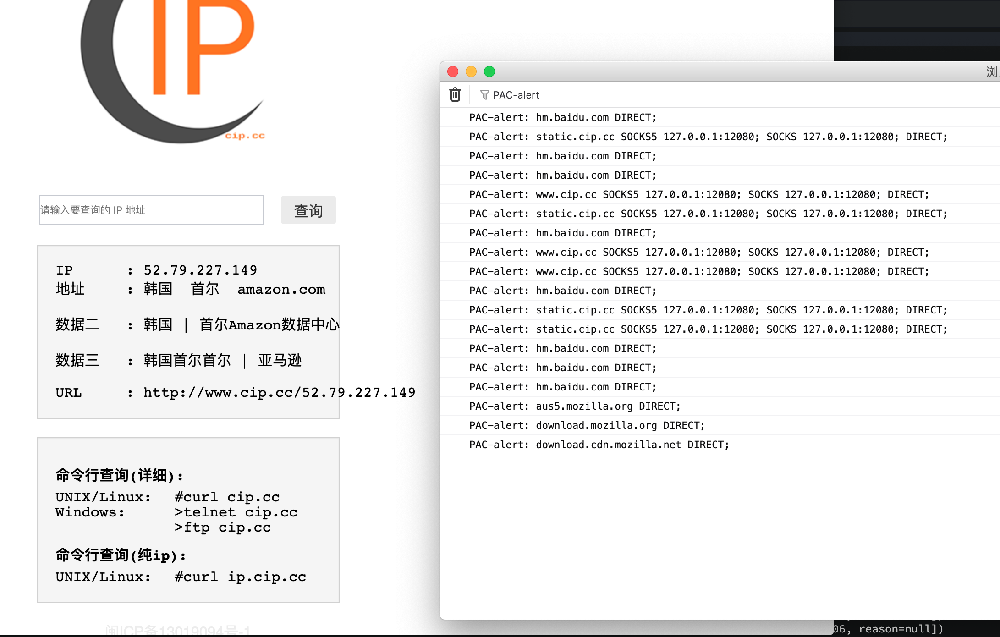

# 自己动手实现一个Socket5和HTTP代理服务器

## 启用https/wss

```bash
# 生成自签证书
keytool -genkey -alias tomcat  -storetype PKCS12 -keyalg RSA -keysize 2048  -keystore keystore.p12 -validity 365
```

```bash
# pem转p12
openssl pkcs12 -export -in fullchain.pem -inkey privkey.pem -out fullchain_and_key.p12 -name tomcat
```

## 预览

